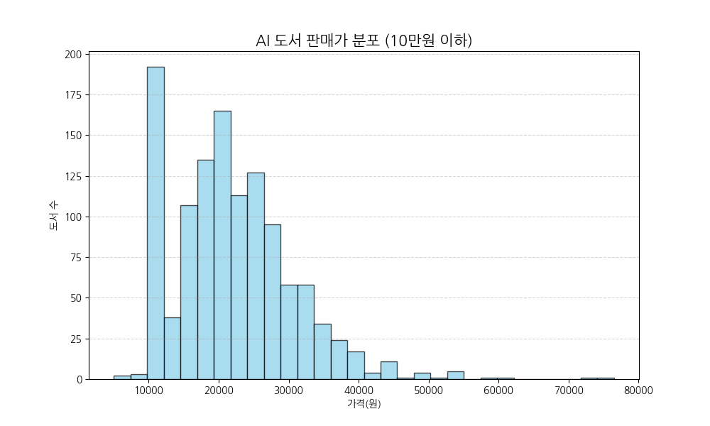
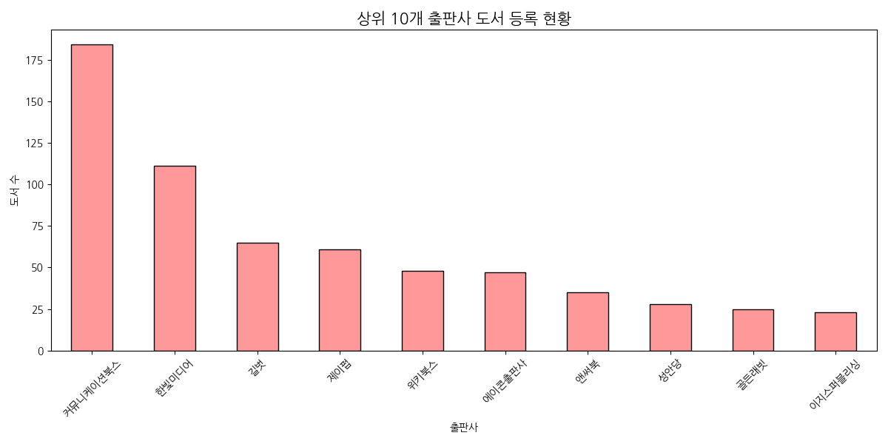
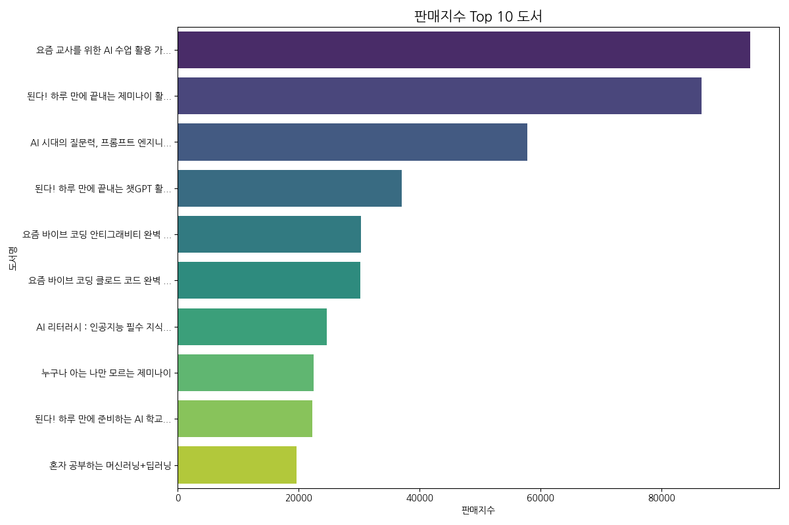
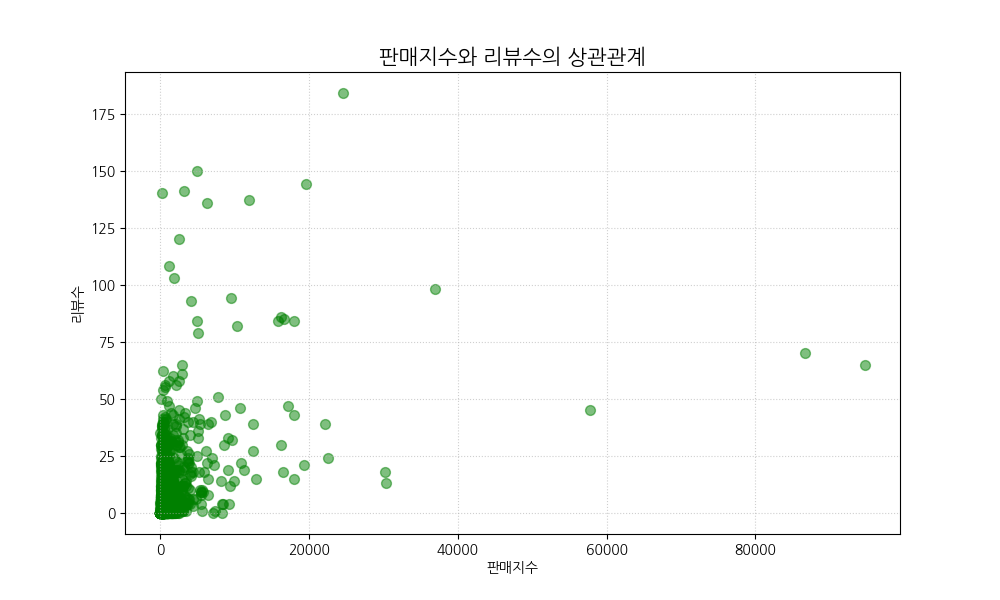
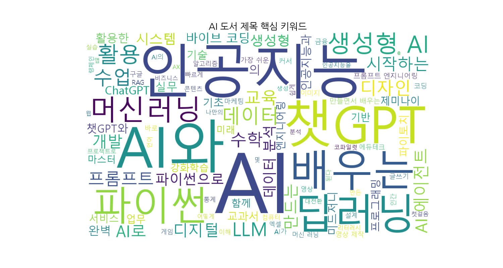

# Yes24 AI 도서 데이터 분석 및 시각화 리포트

본 문서는 `yes24\data\yes24_ai.csv` 데이터를 바탕으로 수행한 탐색적 데이터 분석(EDA) 결과를 담고 있습니다. 수집된 **1,200권**의 도서 데이터를 통해 AI 관련 도서 시장의 트렌드를 분석했습니다.

---

## 1. 데이터 개요 및 요약 통계

### 1.1 데이터 구성
- **총 분석 도서 수:** 1,200권
- **주요 컬럼:** 제목, 저자, 출판사, 발행일, 정가, 판매가, 리뷰수, 판매지수 등

### 1.2 주요 수치 요약
| 항목 | 분석 결과 | 비고 |
| :--- | :---: | :--- |
| **평균 판매가** | **22,471원** | 일반적인 IT 실무서 가격대 형성 |
| **최다 출판사** | **커뮤니케이션북스** | 184권 (인공지능 총서 시리즈 영향) |
| **최고 판매지수** | **94,698** | *요즘 교사를 위한 AI 수업 활용 가이드* |
| **최다 리뷰 도서** | **184건** | *AI 리터러시 : 인공지능 필수 지식부터...* |

---

## 2. 시각화 분석 결과

### 2.1 도서 판매가 분포
대부분의 AI 도서는 **15,000원 ~ 30,000원** 구간에 밀집되어 있습니다. 5만원 이상의 고가 도서는 주로 전문 학술서나 교육 패키지 상품입니다.

### 2.2 출판사별 시장 점유율 (상위 10개)
**커뮤니케이션북스**가 가장 많은 종수를 보유하고 있으며, **한빛미디어**, **길벗**, **이지스퍼블리싱** 등 전통적인 IT 전문 출판사들이 그 뒤를 잇고 있습니다.

### 2.3 판매지수 상위 10개 도서
판매지수가 높은 도서들은 주로 **교육(교사)**, **생성형 AI(챗GPT, 제미나이)**, **바이브 코딩** 등 실무와 직접적으로 연결된 주제를 다루고 있습니다.

### 2.4 판매지수와 리뷰수의 상관관계
판매지수가 높을수록 리뷰수가 증가하는 경향(양의 상관관계)을 보이나, 최근 출간된 베스트셀러의 경우 높은 판매지수에 비해 리뷰수가 아직 쌓이지 않은 모습도 관찰됩니다.

---

## 3. 핵심 키워드 분석 (Word Cloud)

도서 제목에서 가장 많이 추출된 키워드는 다음과 같습니다.
- **AI / 인공지능:** 시장의 핵심 키워드
- **챗GPT / 딥러닝:** 생성형 AI 및 기술적 근간에 대한 높은 관심
- **교육 / 교사:** 교육 현장에서의 AI 활용 요구 반영
- **파이썬 / 코딩:** 데이터 분석 및 개발 도구로서의 파이썬 비중

---

## 4. 최종 결론
1. **실용 중심 시장:** 이론 중심의 서적보다 챗GPT, 제미나이 등을 활용한 **'업무 자동화'**, **'수업 활용'** 등 실용적인 가이드북이 시장을 주도하고 있습니다.
2. **출판사 전략:** **커뮤니케이션북스**는 짧고 명확한 주제의 'AI 총서'로 물량을 확보하고 있으며, **한빛미디어**와 **길벗**은 검증된 기술 실무서로 상위권을 점유하고 있습니다.
3. **타겟 확장:** AI의 타겟이 개발자를 넘어 **교사, 시니어, 일반 직장인**으로 급격히 확장되고 있음이 데이터로 확인되었습니다.

---
*본 리포트는 Gemini AI 에이전트를 통해 2026-02-21에 자동 생성되었습니다.*
