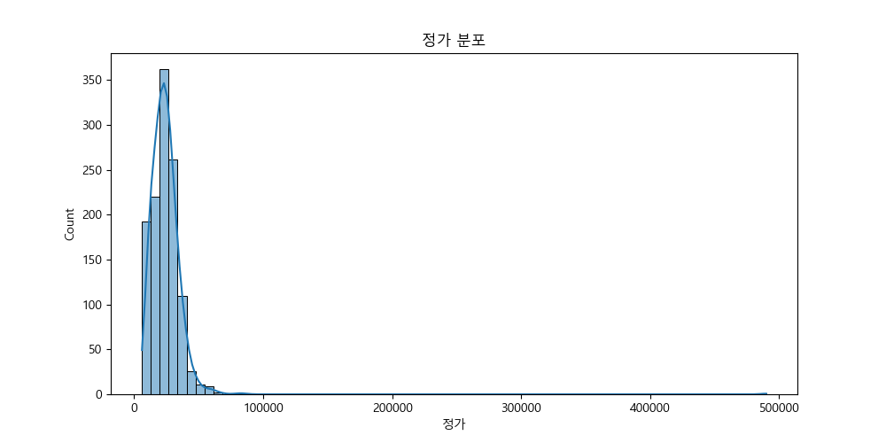
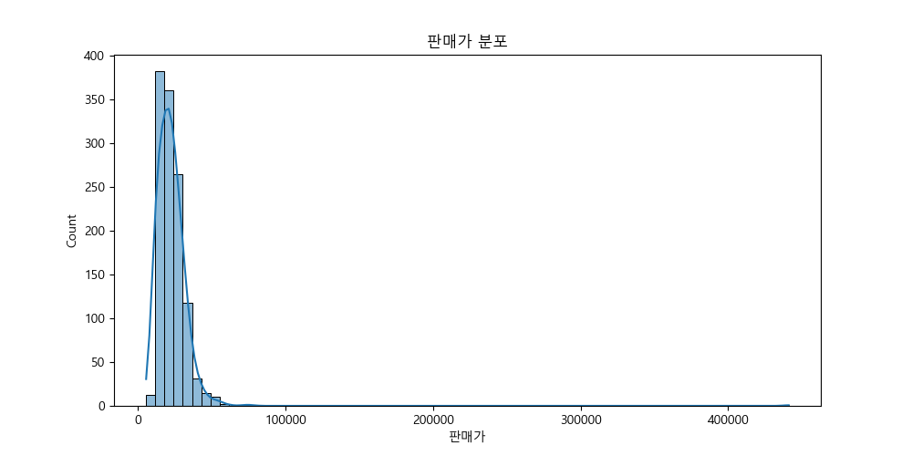
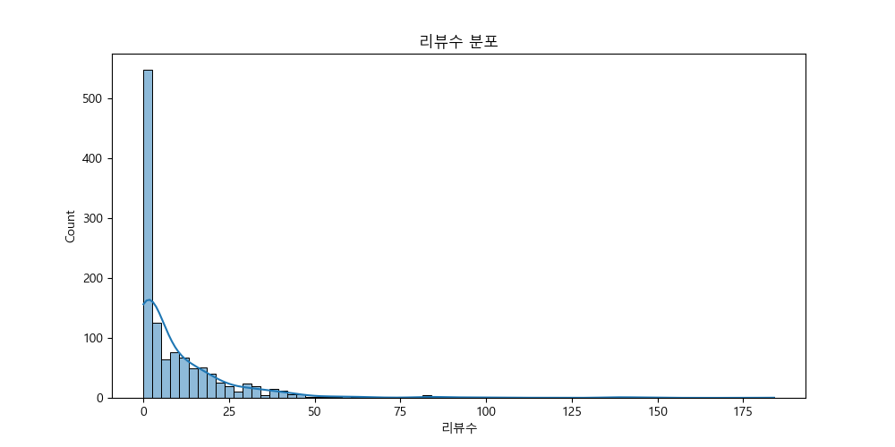
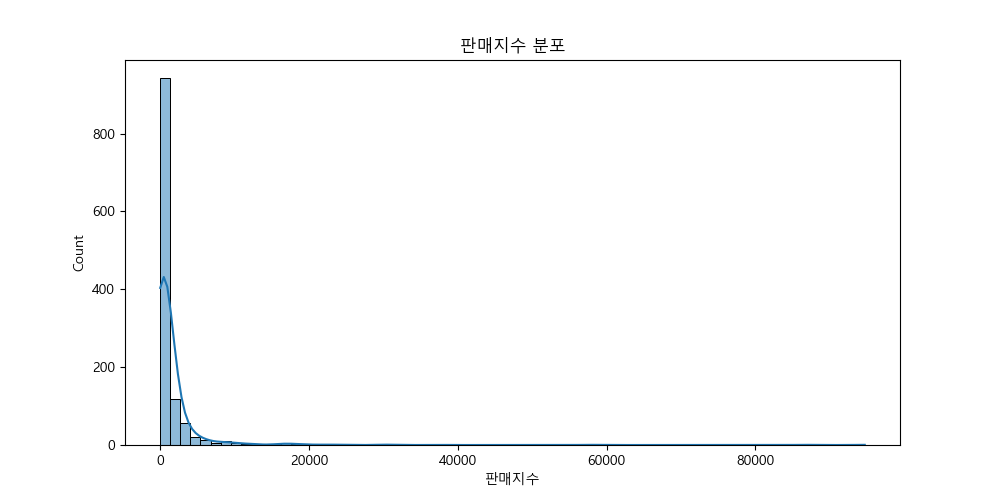
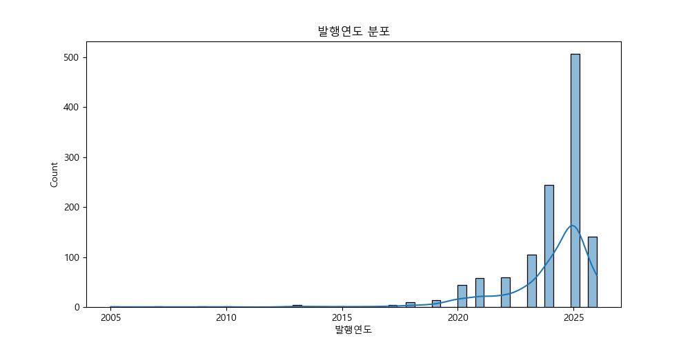
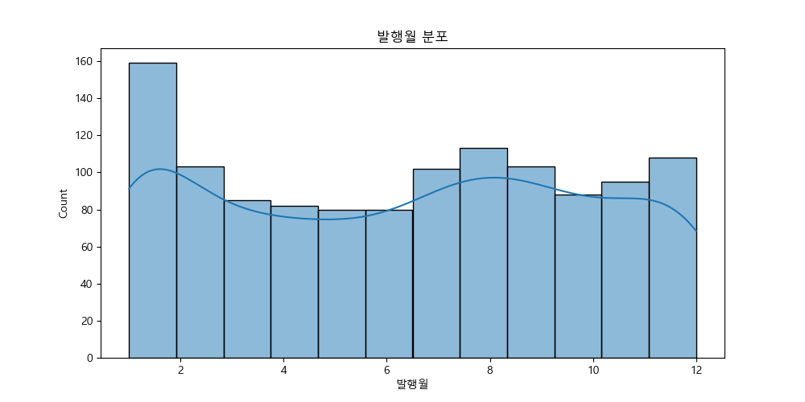
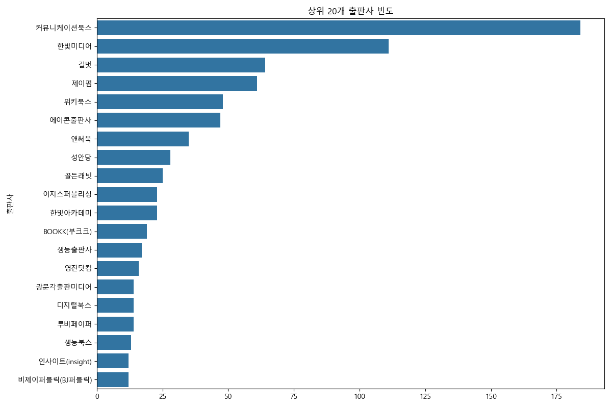
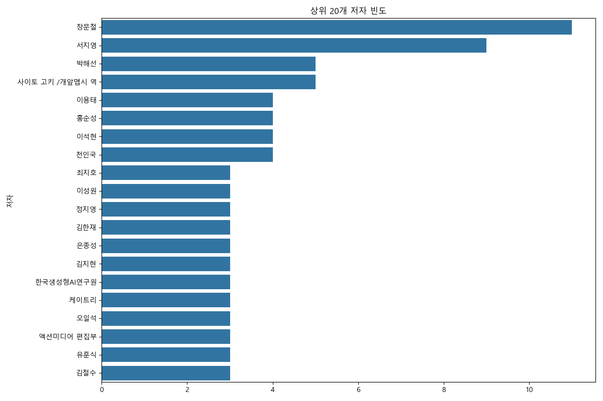
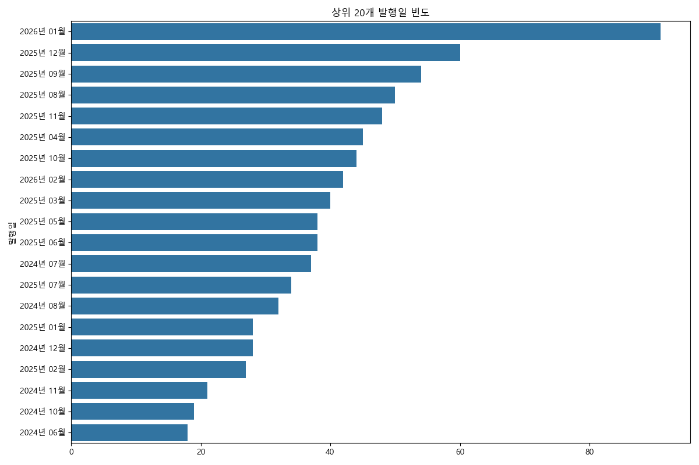
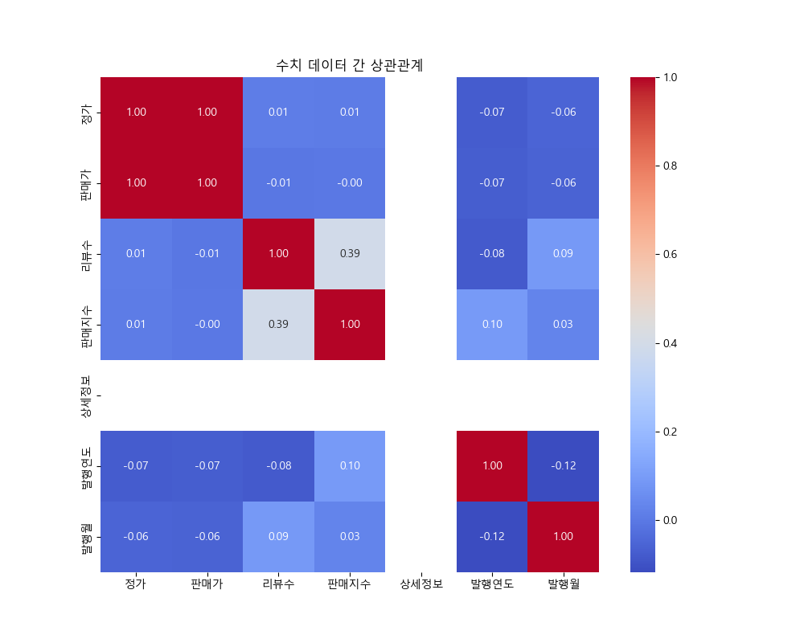

# Yes24 AI 도서 데이터 분석 보고서

## 1. 데이터 불러오기 및 전처리

데이터 전처리가 완료되었습니다.

## 2. 기초 통계 분석

### 데이터 정보 (info)

```
<class 'pandas.DataFrame'>
Index: 1198 entries, 0 to 1199
Data columns (total 13 columns):
 #   Column    Non-Null Count  Dtype  
---  ------    --------------  -----  
 0   제목        1198 non-null   str    
 1   저자        1197 non-null   str    
 2   출판사       1198 non-null   str    
 3   발행일       1198 non-null   str    
 4   정가        1198 non-null   int64  
 5   판매가       1198 non-null   int64  
 6   리뷰수       1198 non-null   int64  
 7   판매지수      1198 non-null   int64  
 8   상세정보      0 non-null      float64
 9   설명        1178 non-null   str    
 10  상세페이지URL  1198 non-null   str    
 11  발행연도      1198 non-null   int64  
 12  발행월       1198 non-null   int64  
dtypes: float64(1), int64(6), str(6)
memory usage: 131.0 KB

```

### 수치형 데이터 기술통계

|       |       정가 |      판매가 |       리뷰수 |     판매지수 |   상세정보 |       발행연도 |        발행월 |
|:------|---------:|---------:|----------:|---------:|-------:|-----------:|-----------:|
| count |   1198   |   1198   | 1198      |  1198    |      0 | 1198       | 1198       |
| mean  |  24359.5 |  22503.8 |   10.5125 |  1523.47 |    nan | 2023.92    |    6.3389  |
| std   |  16399.3 |  14740.9 |   18.1928 |  5002.4  |    nan |    2.15204 |    3.63433 |
| min   |   6000   |   5400   |    0      |    12    |    nan | 2005       |    1       |
| 25%   |  18000   |  16200   |    0      |   180    |    nan | 2023       |    3       |
| 50%   |  23000   |  20950   |    4      |   423    |    nan | 2025       |    7       |
| 75%   |  29000   |  27000   |   14      |  1122    |    nan | 2025       |    9       |
| max   | 490000   | 441000   |  184      | 94698    |    nan | 2026       |   12       |

### 범주형 데이터 기술통계

|        | 제목                     | 저자   | 출판사      | 발행일       | 설명                                                                                                                           | 상세페이지URL                                      |
|:-------|:-----------------------|:-----|:---------|:----------|:-----------------------------------------------------------------------------------------------------------------------------|:----------------------------------------------|
| count  | 1198                   | 1197 | 1198     | 1198      | 1178                                                                                                                         | 1198                                          |
| unique | 1181                   | 1045 | 229      | 105       | 1171                                                                                                                         | 1198                                          |
| top    | 된다! 하루 만에 끝내는 챗GPT 활용법 | 장문철  | 커뮤니케이션북스 | 2026년 01월 | AI로 시작하는 음악, 쉽고 재미있게 나만의 음악을 만들며, 음악의 매력에 빠져 보자!'AI에서 클릭 몇 번이면 음악이 뚝딱 완성되는데, 과연 책을 볼 필요가 있을까?' 직접 AI를 사용하여 음악을 만들어 보면 가졌던... | https://www.yes24.com/product/goods/163301895 |
| freq   | 2                      | 11   | 184      | 91        | 2                                                                                                                            | 1                                             |

*인사이트: 데이터는 약 1200개의 도서 정보를 포함하며, 숫자형 데이터(가격, 판매지수 등)와 범주형 데이터(출판사, 저자 등)로 구성되어 있습니다. '저자'와 '출판사'의 유니크한 값이 많은 것으로 보아 다양한 저자와 출판사가 참여하고 있음을 알 수 있습니다.*

## 3. 시각화 분석

### 수치 데이터 분포

**정가 분포**



**판매가 분포**



**리뷰수 분포**



**판매지수 분포**



**상세정보 분포**


**발행연도 분포**



**발행월 분포**



*인사이트: 가격 데이터는 대부분 2-4만원대에 집중되어 있으며, 일부 고가의 책이 존재합니다. 판매지수와 리뷰수는 오른쪽으로 꼬리가 긴 분포를 보여 소수의 책이 매우 높은 판매지수와 리뷰수를 가짐을 시사합니다.*

### 범주형 데이터 분포

**상위 20개 출판사**



**상위 20개 저자**



**상위 20개 발행일**



*인사이트: '한빛미디어', '길벗', '제이펍' 등의 출판사가 AI 관련 도서를 다수 출판하고 있습니다. 특정 저자들이 여러 권의 책을 집필한 경우도 확인됩니다.*

### 상관 관계 분석



*인사이트: '판매가'와 '정가'는 매우 높은 양의 상관관계를 보입니다. '리뷰수'와 '판매지수'도 어느 정도 양의 상관관계를 보여, 리뷰가 많을수록 판매지수가 높은 경향이 있음을 알 수 있습니다.*

### 도서 제목 워드 클라우드


*인사이트: (konlpy 미사용으로 정확도가 낮을 수 있음) '인공지능', '챗GPT', '파이썬' 등의 키워드가 자주 등장합니다.*

## 4. 교차 분석 (Pivot & Crosstab)

### 상위 10개 출판사별 평균 판매가, 리뷰수, 판매지수

| 출판사              |     리뷰수 |     판매가 |     판매지수 |
|:-----------------|--------:|--------:|---------:|
| 코리아닷컴(Korea.com) | 45      | 24300   | 57786    |
| 윌북(willbook)     | 46      | 22320   | 10698    |
| 이지스퍼블리싱          | 26.5217 | 19847   |  8662.17 |
| 매일경제신문사          |  0      | 18000   |  7092    |
| 골든래빗             | 27.68   | 24220.8 |  6984.36 |
| 시프트              | 12.25   | 29500   |  6951    |
| 위즈덤하우스           | 21.5    | 19350   |  6508.5  |
| 다빈치books         | 18      | 19800   |  5568    |
| 아카데미소프트          |  1      | 15300   |  5562    |
| 로드북              |  5      | 24525   |  5144.25 |

*인사이트: 판매지수가 높은 책을 출판하는 출판사들의 평균 판매가와 리뷰수를 비교해볼 수 있습니다.*

### 발행연도별 평균 가격 변화

|   발행연도 |      정가 |     판매가 |
|-------:|--------:|--------:|
|   2005 | 22000   | 19800   |
|   2007 | 15000   | 15000   |
|   2009 | 29000   | 29000   |
|   2010 | 29000   | 29000   |
|   2013 | 19750   | 19025   |
|   2014 | 27000   | 25600   |
|   2015 | 24500   | 23500   |
|   2016 | 24500   | 23400   |
|   2017 | 24500   | 22050   |
|   2018 | 37444.4 | 34088.9 |
|   2019 | 25628.6 | 23280   |
|   2020 | 26772.7 | 24375.5 |
|   2021 | 27086.2 | 24844   |
|   2022 | 29425.4 | 26793.1 |
|   2023 | 27634.3 | 25443.1 |
|   2024 | 24020.9 | 22083.2 |
|   2025 | 22089.1 | 20514.6 |
|   2026 | 25801.4 | 24044.8 |

*인사이트: 시간에 따른 AI 도서의 평균 가격 변화 추이를 파악할 수 있습니다.*

### 상위 5개 출판사의 연도별 출판 건수

| 출판사      |   2014 |   2015 |   2017 |   2018 |   2019 |   2020 |   2021 |   2022 |   2023 |   2024 |   2025 |   2026 |
|:---------|-------:|-------:|-------:|-------:|-------:|-------:|-------:|-------:|-------:|-------:|-------:|-------:|
| 길벗       |      0 |      0 |      1 |      1 |      2 |      3 |      4 |      6 |      4 |      9 |     29 |      5 |
| 위키북스     |      0 |      0 |      0 |      0 |      0 |      2 |      5 |      1 |      6 |     13 |     19 |      2 |
| 제이펍      |      0 |      0 |      1 |      2 |      0 |      4 |      4 |      3 |      8 |      9 |     24 |      6 |
| 커뮤니케이션북스 |      0 |      0 |      0 |      0 |      0 |      0 |      0 |      0 |      0 |     33 |    120 |     31 |
| 한빛미디어    |      1 |      1 |      2 |      1 |      2 |      5 |      7 |     11 |     15 |     26 |     34 |      6 |

*인사이트: 주요 출판사들이 언제부터 AI 관련 서적을 활발히 출판하기 시작했는지 경향을 볼 수 있습니다.*

### 상위 10명 저자의 평균 판매지수

| 저자                                       |   판매지수 |
|:-----------------------------------------|-------:|
| 박진환, 공지훈, 서원진                            |  94698 |
| 류한석                                      |  57786 |
| 권서림                                      |  44319 |
| 김용성                                      |  24621 |
| 프롬프트 크리에이터                               |  23649 |
| 정인걸, 김경수                                 |  22203 |
| 최지호                                      |  21346 |
| 박찬, 김병석, 전수연, 김지용, 구현희  외 3명             |  18048 |
|                                          |        |
| 정보 더 보기/감추기                              |        |
|                                          |        |
|                                          |        |
|                                          |        |
| 박찬                                       |        |
| 김병석                                      |        |
| 전수연                                      |        |
| 김지용                                      |        |
| 구현희                                      |        |
| 전채원                                      |        |
| 홍찬우                                      |        |
| 이상선                                      |        |
| 안익재, 황의태                                 |  18048 |
| 조쉬                                       |  17979 |

*인사이트: 어떤 저자의 책들이 시장에서 좋은 반응을 얻고 있는지 파악할 수 있습니다.*

### 판매가 가격대별 도서 수

| 가격대     |   count |
|:--------|--------:|
| 1.5만 이하 |     241 |
| 1.5-2만  |     319 |
| 2-2.5만  |     239 |
| 2.5-3만  |     220 |
| 3-4만    |     144 |
| 4만 이상   |      35 |

*인사이트: 대부분의 AI 도서가 어떤 가격대에 분포하는지 명확하게 확인할 수 있습니다.*

